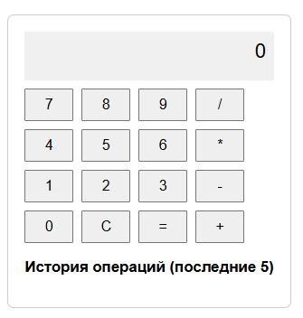
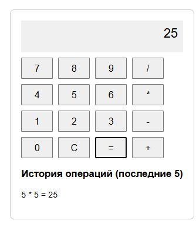
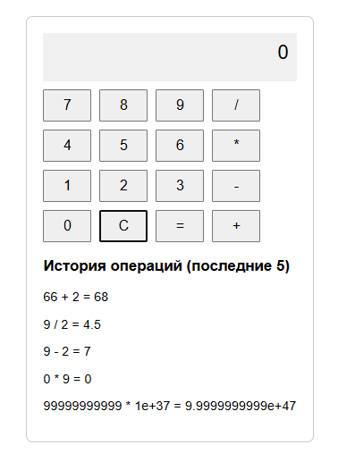

# LI

Отчет в формате readme
1.Инструкции по запуску проекта
    Скачать проект или только папку "LI" открыть файл index.html , откройте файл не через файл "file:///C:LL_04/index.html"а например через приложение XAMP, и используйте калькулятор, нажмите кнопку "=" для получения результата, так же есть возможность удаления "С", и есть история последних 5 действий.
2. Автор проекта Спатару Евгений группа IAFR2403 Ru 
3.Описание Индивидуальной работы:
    Индивидуальная работа с DOM, событиями, обработкой данных, пользовательским вводом и организацией кода в модульной структуре. 
  Краткая документация к проекту
    index.html -главный HTML файл для запуска проекта в браузере 
    calculator.js  -файл со скриптами который и является индивидуальной работой
    index.js – главный файл, который будет импортировать другие модули.
    transactions.js – модуль для работы с массивом транзакций.
    ui.js – модуль для работы с DOM (отрисовка таблицы, формы и т. д.).
    style.css - файл со стилями для таблицы 
4.Примеры использования проекта с приложением скриншотов или фрагментов кода
 (открытие калькулятора)
 (первое действие)
 (демонстрация истории действий)

5.Список использованных источников
        -https://developer.mozilla.org/en-US/docs/Glossary/DOM
        -LL_04
6.Дополнительные важные аспекты, если применимо
        - Из за ошибки "CORS" благодаря которой нельзя запускать файл через стандартные файлы с компьютера, я возпользовался XAMP через сервер Apache