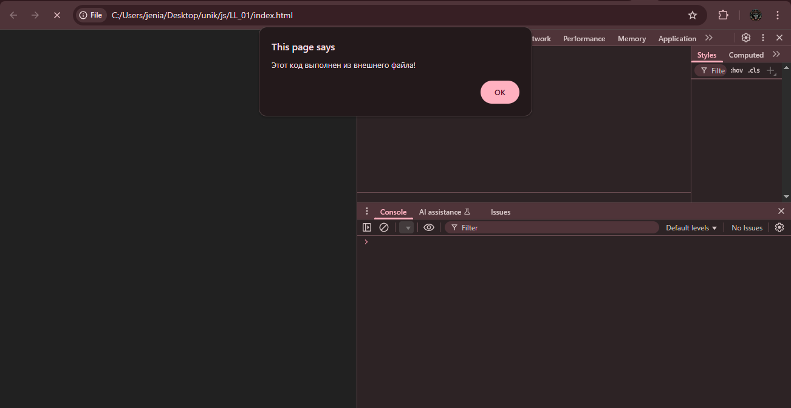
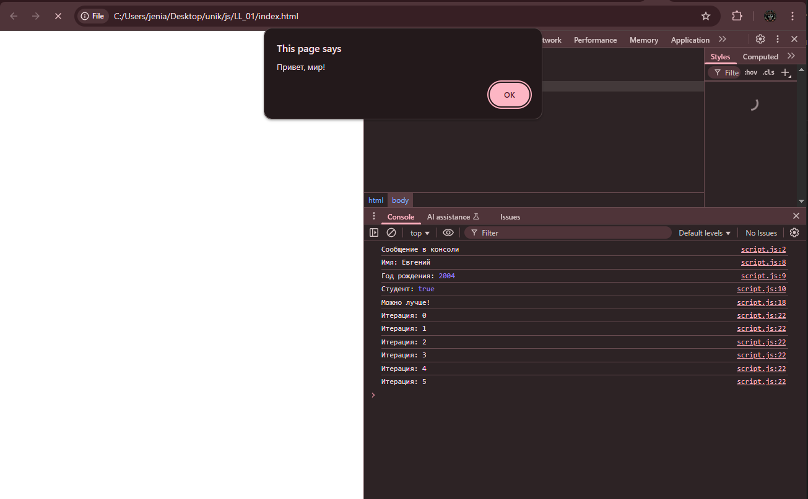

# LL_01

Отчет в формате readme
1.Инструкции по запуску проекта
    Скачать проэкт или только папку "LL_01" открыть файл index.html , откройте DevTools, следовать указаниям на сайте, смотреть на консоль 
2.Описание лабораторной работы:
    Простая лабораторная работа для новичка помогающая ознакомиться с языком прогроммирования JavsScript. Обычные выводы в консоль и использования обычного цикла с терациями а так же подключения JS к HTML
3.Краткая документация к проекту
    index.html -главный HTML файл для запуска проэкта в браузере 
    script.js  -файл со скриптами который и являеться лабораторной работой
4.Примеры использования проекта с приложением скриншотов или фрагментов кода

5.Ответы на контрольные вопросы
    1.Чем отличается var от let и const?
        Отличие заключаеться в их видимости, возможности менять переменную по ходу выполнения скрипта а так же возможность их повторного объявления.
    2.Что такое неявное преобразование типов в JavaScript?
        Неявное преобразование это автоматическое преобразование значений например "5" + 2 результат не выдаст ошибку но может сработать не так как запланированно.
    3.Как работает оператор == в сравнении с ===?
       "==" сравнивает невзирая на тип данных, "===" сравнивает по существу, тоесть по типу переменной тоже.   
6.Список использованных источников
        -https://developer.mozilla.org/en-US/docs/Web/JavaScript/Reference/Statements/let
7.Дополнительные важные аспекты, если применимо
        ---