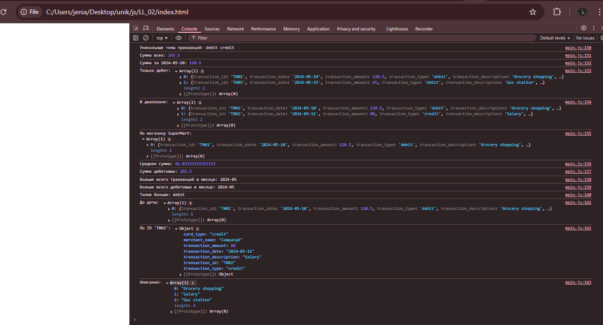
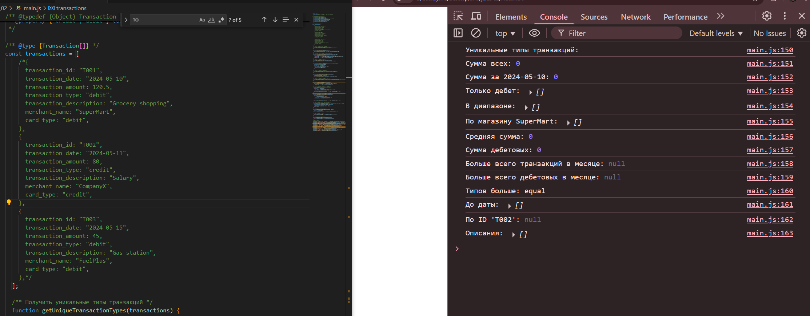
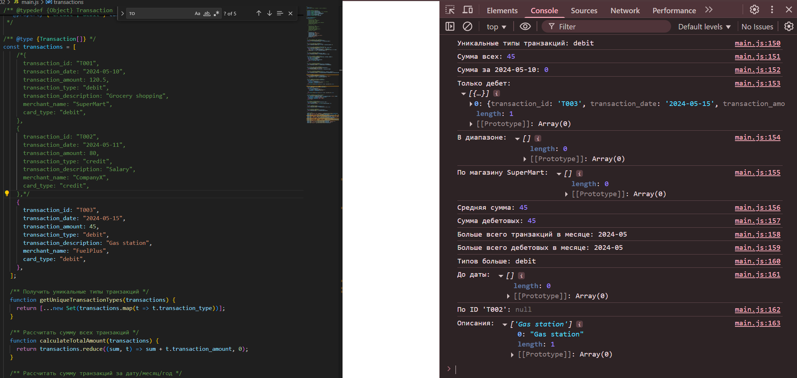

# LL_02

Отчет в формате readme
1.Инструкции по запуску проекта
    Скачать проект или только папку "LL_02" открыть файл index.html , откройте DevTools, смотреть на консоль 
2.Описание лабораторной работы:
    Лабораторная работа посвященная основам работы с массивами, функциями и объектами в JavaScript. А так же их применение для обработки и анализа транзакций.
3.Краткая документация к проекту
    index.html -главный HTML файл для запуска проекта в браузере 
    script.js  -файл со скриптами который и является лабораторной работой
4.Примеры использования проекта с приложением скриншотов или фрагментов кода
 (3 транзакции)
 (0 транзакции)
   (1 транзакция)
5.Ответы на контрольные вопросы
    1.Какие методы массивов можно использовать для обработки объектов в JavaScript?
        map, filter, reduce, forEach, find — с их помощью можно перебирать, менять, искать и фильтровать объекты.
    2.Как сравнивать даты в строковом формате в JavaScript?
        Обычно переводим через new Date() и сравниваем, типа new Date(date1) > new Date(date2).
    3.В чем разница между map(), filter() и reduce() при работе с массивами объектов?
       map — меняет элементы, filter — отбирает нужные, reduce — всё сводит к одному значению (например, сумме).
6.Список использованных источников
        -https://developer.mozilla.org/en-US/docs/Web/JavaScript/Reference/Global_Objects/Array
7.Дополнительные важные аспекты, если применимо
        -Про Примеры транзакций я вспомнил только после ответов на вопросы(