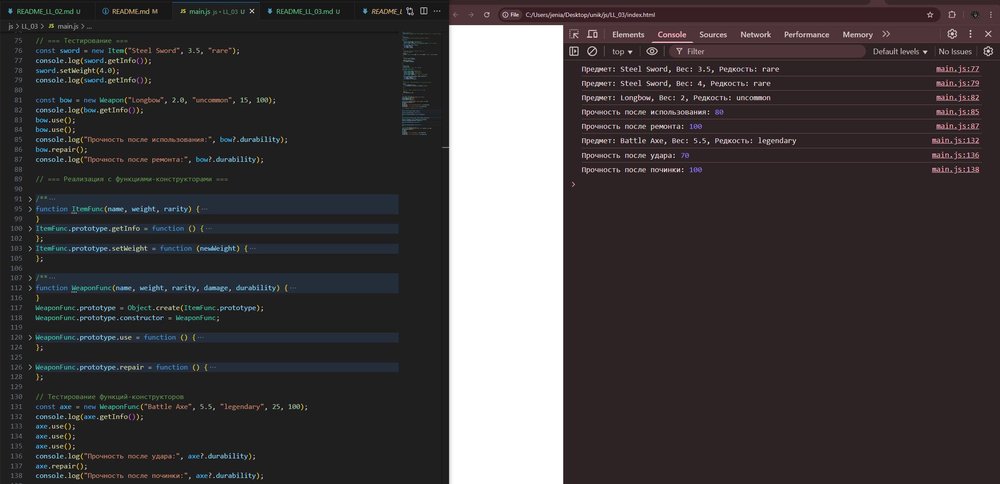

# LL_03

Отчет в формате readme
1.Инструкции по запуску проекта
    Скачать проект или только папку "LL_03" открыть файл index.html , откройте DevTools, смотреть на консоль 
2.Описание лабораторной работы:
    Лабораторная работа ознакомляющая с классами и объектами в JavaScript. Использование конструкторов и методов, а также реализация наследования.
3.Краткая документация к проекту
    index.html -главный HTML файл для запуска проекта в браузере 
    script.js  -файл со скриптами который и является лабораторной работой
4.Примеры использования проекта с приложением скриншотов или фрагментов кода

5.Ответы на контрольные вопросы
    1.Какое значение имеет this в методах класса?
        Оно указывает на сам объект, через который вызван метод.
    2.Как работает модификатор доступа # в JavaScript?
        Делает поле приватным — к нему нельзя обратиться снаружи объекта.
    3. чем разница между классами и функциями-конструкторами?
       Классы — это более современный и удобный синтаксис, а функции-конструкторы — старый способ создания объектов.
6.Список использованных источников
        -https://developer.mozilla.org/en-US/docs/Web/JavaScript/Reference/Global_Objects/Object
7.Дополнительные важные аспекты, если применимо
        ---