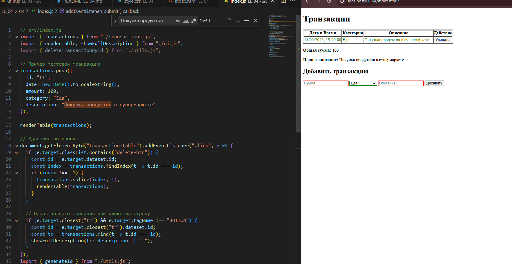
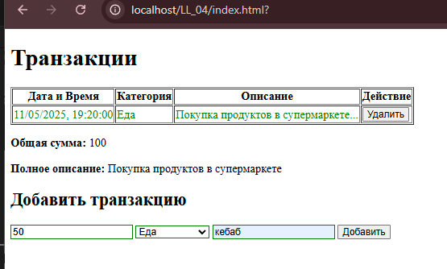
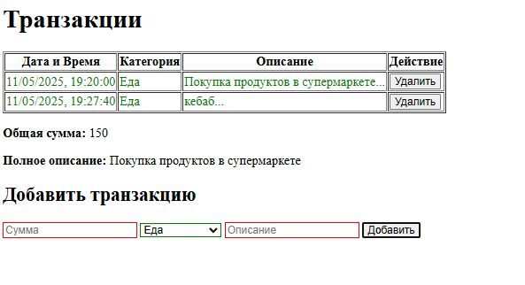
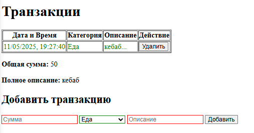

# LL_04

Отчет в формате readme
1.Инструкции по запуску проекта
    Скачать проект или только папку "LL_04" открыть файл index.html , откройте файл не через файл "file:///C:LL_04/index.html"а например через приложение XAMP, введите сумму, описание и нажмите кнопку добавить, так же есть возможность нажать на запись в таблице для отображения полного описания, а так же есть реализация удаления элемента из таблицы
2.Описание лабораторной работы:
    Лабораторная работа с основами взаимодействия JS с DOM-деревом на основе веб-приложения для учета личных финансов.
3.Краткая документация к проекту
    index.html -главный HTML файл для запуска проекта в браузере 
    script.js  -файл со скриптами который и является лабораторной работой
    index.js – главный файл, который будет импортировать другие модули.
    transactions.js – модуль для работы с массивом транзакций.
    ui.js – модуль для работы с DOM (отрисовка таблицы, формы и т. д.).
    utils.js – вспомогательные функции (например, генерация ID, форматирование даты).
    style.css - файл со стилями для таблицы 
4.Примеры использования проекта с приложением скриншотов или фрагментов кода
 (тестовая автоматическая запись, а так же видно крассный индикатор что означает неправильность заполнения формы)
 (ввожу данные)
 (нажал "добавить")
 (нажал "удалить")
5.Ответы на контрольные вопросы
    1.Каким образом можно получить доступ к элементу на веб-странице с помощью JavaScript?
        С помощью document.getElementById(), querySelector() или других методов DOM.
    2.Что такое делегирование событий и как оно используется для эффективного управления событиями на элементах DOM?
        Это когда вешаем обработчик на родителя, а не на каждый элемент — удобно, если элементы добавляются динамически.
    3.Как можно изменить содержимое элемента DOM с помощью JavaScript после его выборки?
        Используем element.textContent, innerText или innerHTML, в зависимости от задачи.
    4.Как можно добавить новый элемент в DOM дерево с помощью JavaScript?
        Создаём элемент через document.createElement() и вставляем с помощью appendChild() или append().

6.Список использованных источников
        -https://developer.mozilla.org/en-US/docs/Glossary/DOM
7.Дополнительные важные аспекты, если применимо
        - Из за ошибки "CORS" благодаря которой нельзя запускать файл через стандартные файлы с компьютера, я возпользовался XAMP через сервер Apache